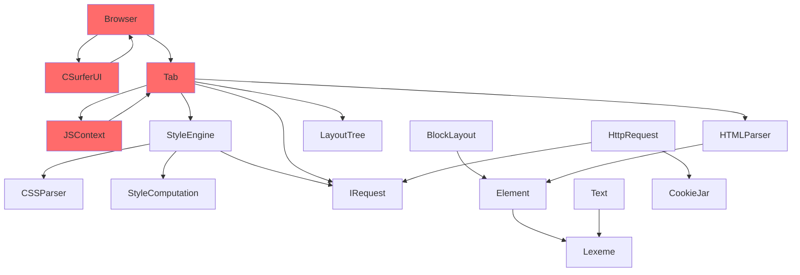

# Codebase Refactoring Plan — Full Audit & Rescore

## Audit Methodology

Examined all 63 source files (5,740 LOC) and 6 test files (202 LOC). Every claim from the previous summary was verified against actual code with `grep`, `view_file`, and line counts.

---

## Updated Codebase Score

| Dimension | Previous | Verified | Δ | Notes |
|---|---|---|---|---|
| Modularity & Boundaries | 5 | **5** | = | 11 modules exist but no per-module CMake, single flat `csurfer_lib` |
| Coupling | 3 | **3** | = | 2 circular deps confirmed, raw `Browser*` in CSurferUI, raw `Tab*` in JSContext |
| Cohesion & SRP | 4 | **4** | = | Tab.cpp = 502 lines, 14+ responsibilities confirmed |
| Testability | 2 | **3** | ↑ | Now 6 GTest suites (was claimed 1). Still only leaf modules tested |
| Naming Conventions | 6 | **6** | = | ~10 camelCase violations in JSContext (not 25+, most were fixed) |
| Code Duplication | 4 | **5** | ↑ | `to_lower`/`trim` are centralized. BFS/DFS and stash pattern still duplicated |
| Error Handling & Logging | 3 | **3** | = | 27 raw cout/cerr, 7 silent `catch(...)`, logging macros defined but unused |
| Thread Readiness | 2 | **2** | = | No atomics, no mutex, mutable shared state everywhere |
| Dependency Injection | 3 | **4** | ↑ | `IRequest` interface exists. Still missing `IJSHost`, `IBrowserCommands` |
| Magic Numbers | 3 | **5** | ↑ | Config.h centralizes most. ~8 stragglers remain (60, 100, 20, 25, 16, 200) |
| **Overall** | **3.72** | **4.0** | ↑ | Previous work improved leaves; core remains problematic |

---

## Verified Critical Issues

### ✅ Confirmed Issues

| Issue | Evidence |
|---|---|
| **Tab.cpp god object** | 502 lines, 14+ methods: load, render, scroll, click, keypress, form submit, CSP, history, scrollbar, layout rebuild |
| **Circular dep: JSContext ↔ Tab** | `JSContext.h:47` `Tab *tab_` → `JSContext.cpp:2` `#include "browser/Tab.h"`. Accesses `tab_->root()`, `tab_->url()`, `tab_->network_engine()` |
| **Circular dep: CSurferUI ↔ Browser** | `CSurferUI.h:36` `Browser *browser_` → calls `browser_->close_tab()`, `browser_->go_back()`, etc. `Browser.h:80` owns `CSurferUI ui_` |
| **27 raw cout/cerr** | 17 `std::cout` + 10 `std::cerr` across 8 files. `ENABLE_LOGGING`/`LOG_LEVEL_*` defined in CMake but **zero usage in source** |
| **7 silent `catch(...)`** | BlockLayout.cpp:91,130,280,300,503, StyleComputation.cpp:62,94 |
| **3 `const_cast`** | Tab.cpp:335,346,413 — casting away const on Element* for JS dispatch and focus |
| **31 `dynamic_cast`** | 20 in BlockLayout.cpp, 5 in Tab.cpp, 3 in HTMLParser.cpp, 1 in JSContext.cpp, 1 in StyleComputation.cpp, 1 in StyleEngine.cpp |
| **7× `duk_push_global_stash` pattern** | JSContext.cpp:13,106,157,175,193,227,242 — identical 3-line boilerplate repeated |
| **4× BFS/DFS traversal** | Tab.cpp (find scripts L159, find title L481, form submit L419), StyleEngine.cpp (collect stylesheets L24), JSContext.cpp (querySelectorAll L115) |
| **`#include` in middle of file** | BlockLayout.cpp:486 `#include "config/Config.h"` at line 486 |
| **Remaining magic numbers** | `60` (Tab.cpp:240,455), `100` (Tab.cpp:273,291), `20` (Tab.cpp:255-256, CSurferUI:77), `25` (CSurferUI:184), `16` (Browser.cpp:41,150), `200` (BlockLayout.cpp:450) |

### ❌ Corrections from Previous Summary

| Previous Claim | Actual Finding |
|---|---|
| "Tab.cpp is 485 lines" | **502 lines** |
| "~2% test coverage, only 1 test file, no GTest" | **6 GTest suites** with AAA pattern, covering utils, url, config, gfx/Color. ~3.5% line coverage |
| "3 copies of to_lower()" | **1 copy** — centralized in `utils::to_lower()`. All call sites use it correctly |
| "3 copies of trim()" | **1 copy** — centralized in `utils::trim()`. Exception: BlockLayout.cpp:60-61 has inline trim logic |
| "25+ naming violations" | **~10 violations**, mostly in JSContext: `native_querySelectorAll`, `native_getAttribute`, `native_innerHTML_set`, `native_XMLHttpRequest_send`, `native_cookie_get/set` |
| "assert() in URL parsing" | **None found** — URL uses `throw utils::UrlError()` correctly |

---

## Remaining Magic Numbers Inventory

| Value | Location | Should Be |
|---|---|---|
| `60` | Tab.cpp:240,455 | `config::DOCUMENT_BOTTOM_PADDING` |
| `100` | Tab.cpp:273,291 | `config::SCROLLBAR_DOCUMENT_PADDING` |
| `20` | Tab.cpp:255-256 | `config::SCROLLBAR_MIN_THUMB_HEIGHT` |
| `25` | CSurferUI.cpp:184 | `config::TAB_CLOSE_BUTTON_WIDTH` |
| `16` | Browser.cpp:41 | `config::DEFAULT_FONT_SIZE` (already exists) |
| `16` | Browser.cpp:150 | `config::FRAME_DELAY_MS` |
| `200` | BlockLayout.cpp:450 | `config::DEFAULT_INPUT_WIDTH` (already exists, not used here) |
| `600` | CSurferUI.cpp:19 | Should use computed width from config |
| `5`, `10`, `13` | CSurferUI.cpp various | UI micro-layout padding constants |

---

## Module Dependency Map

> [!WARNING]
> Red nodes form **two circular dependency cycles**. These are the highest-risk areas for use-after-free bugs when threading is introduced.

---

## Refactoring Strategy: Leaves-to-Core (5 Phases)

### Phase 1 — Leaves (Zero Risk)

These modules have zero dependents (nothing imports them) or are pure utilities.

- [x] **Config.h**: Add missing constants (`DOCUMENT_BOTTOM_PADDING` (60), `SCROLLBAR_DOCUMENT_PADDING` (100), `SCROLLBAR_MIN_THUMB_HEIGHT` (20), `TAB_CLOSE_BUTTON_WIDTH` (25), `FRAME_DELAY_MS` (16), `ADDRESS_BAR_WIDTH` (600)) and UI micro-layout constants (padding values used in CSurferUI (5, 10, 13)).
- [x] **Geometry.h**: Add `==` operator for `Point` and `Rect` (needed for testing).
- [x] **Color.h / Color.cpp**: Add `==` operator for test assertions. Add story comment to `COLOR_MAP`.
- [x] **Url.cpp**: Add edge case tests for `resolve()`.
- [x] **DefaultStyles.h**: Move to `config/` namespace for consistency.
- [x] **Tests to add**: `test_url.cpp` (Add resolve() tests, about: scheme tests), `test_color.cpp` (Add `==` operator tests, more named colors), `test_config.cpp` (Add new constant sanity checks).

---

### Phase 2 — Middle Layer (Isolated Risk)

- [x] **Rename lexer/ to dom/**: Reflects industry standard. Update all includes.
- [x] **JSContext.h / JSContext.cpp**:
    - [x] Fix naming: `native_querySelectorAll` -> `native_query_selector_all`.
    - [x] Extract `duk_push_global_stash` lookup into a helper `get_context(ctx)`.
    - [x] Extract BFS traversal in `native_querySelectorAll` into `dom::TreeWalker`.
- [x] **CSSParser.cpp**:
    - [x] Add error recovery documentation (story comments).
    - [x] Silent catches on L82, L128 should log warnings (currently to `std::cerr`).
- [x] **HttpRequest.cpp**:
    - [x] RAII wrappers for socket (`close()`) and SSL (`SSL_free`/`SSL_CTX_free`).
    - [x] Fix 5 early-return paths that leaked the socket fd.
    - [x] Make `CookieJar` injectable via constructor.
- [x] **CookieJar.cpp**: Extract cookie file path to `Config.h`. Add story comments.
- [x] **Tests to add**: `test_js_context.cpp` (Mock Tab/Element and test native bridge), `test_http_request.cpp` (Unit test parsing of headers from response strings).

---

### Phase 3 — Integration Layer (Moderate Risk)

- [ ] **StyleComputation.cpp**: Replace 2 silent `catch(...)` blocks (L62, L94) with logged warnings. DI: Accept root element and rules as parameters (already does ✅).
- [ ] **StyleEngine.cpp**: Extract `collect_stylesheet_hrefs` BFS into shared DOM traversal utility. Replace `std::cout` on L81 with logging macro.
- [ ] **BlockLayout.cpp**: Break into `BlockLayout` (layout computation only), `BlockPainter` (paint logic L266-L339), and `InlineLayoutHelper` (text/input word layout L380-L484). Move `#include "config/Config.h"` from L486 to top of file. Replace 5 silent `catch(...)` blocks with logged warnings. Replace magic `200` on L450 with `config::DEFAULT_INPUT_WIDTH`. Extract `parse_linear_gradient` into `css/` utilities. Extract duplicate "px" parsing pattern (appears 3 times).
- [ ] **DisplayItem.h**: Wrap `DrawBoxShadow` 5 parameters in a config struct. Document `DrawLinearGradient` 4 parameters.
- [ ] **HTMLParser.cpp**: Extract `print_tree` to debug-only target or remove. Replace `std::cout` in `print_tree` with logging macro. Consider visitor pattern for `dynamic_cast` on L330, L335.
- [ ] **LayoutTree.h**: Move `debug_print_layout_tree` to debug-only compilation unit. Move `#include <iostream>` on L73 to top or remove.
- [ ] **Tests to add**: `test_html_parser.cpp` (Basic parsing, implicit tags, self-closing tags), `test_block_layout.cpp` (Block vs inline mode detection), `test_style_computation.cpp` (Inheritance, inline styles, cascade).

---

### Phase 4 — Core (Highest Risk)

- [ ] **JSContext.h — Break circular dependency**: Create interface `src/js/IJSHost.h` (`root()`, `url()`, `network_engine()`). `JSContext` takes `IJSHost*` instead of `Tab*`. `Tab` implements `IJSHost`.
- [ ] **CSurferUI.h — Break circular dependency**: Create interface `src/browser/IBrowserCommands.h` (`load()`, `go_back()`, `new_tab()`, `close_tab()`, `switch_to_tab()`, `tab_count()`, `active_tab_index()`, `tab_title()`, `ui_font()`). `CSurferUI` takes `IBrowserCommands*` instead of `Browser*`. `Browser` implements `IBrowserCommands`.
- [ ] **Tab.cpp — Split into focused classes**: Split into `TabNavigator`, `TabRenderer`, `TabInputHandler`, `TabSecurityPolicy`. `Tab` becomes a thin facade delegating to these. Remove 3 `const_cast` calls by redesigning focus/event dispatch ownership. Replace all `std::cout`/`std::cerr` with logging macros.
- [ ] **Browser.cpp**: Extract SDL lifecycle into `SDLInitializer` RAII class. Replace raw SDL pointers with RAII wrappers. Replace `std::cerr` calls with logging macros. Replace magic `16` in `TTF_OpenFont` with `config::DEFAULT_FONT_SIZE`. Replace magic `16` in `SDL_Delay` with `config::FRAME_DELAY_MS`.
- [ ] **Tests to add**: `test_tab_security.cpp` (CSP parsing, is_allowed logic), `test_browser_commands.cpp` (Tab management via IBrowserCommands mock).

---

### Phase 5 — Infrastructure

- [ ] **Unified Logging System**: Create `src/utils/Logger.h` with macros using `ENABLE_LOGGING`/`LOG_LEVEL_*`. Replace all 27 `std::cout`/`std::cerr` log lines. Wire to CMake definitions.
- [ ] **Per-Module CMakeLists.txt**: Create `src/utils/CMakeLists.txt`, `src/dom/CMakeLists.txt`, etc. Each module builds as OBJECT library with explicit public headers. Enforces module boundaries at build time.
- [ ] **Shared DOM Traversal Utility**: Create `src/dom/TreeWalker.h` with `find_elements_by_selector`, `find_element_by_tag`, and `walk_tree`.
- [ ] **Extract "px" Parser Utility**: Create `src/utils/CSSValueParser.h` with `parse_px_value`.
- [ ] **Full GTest Suite**: Target: every module has at least one test file. Missing tests for: `css/`, `html/`, `layout/`, `request/`, `browser/`, `js/`. All tests follow AAA pattern with clear Arrange/Act/Assert separation.
- [ ] **Architecture Documentation**: Update all `arch/` files when module boundaries change. Add new diagrams for: module dependency graph, data flow, thread boundaries (future).

---

## Verification Plan

### Automated Tests
- `./scripts/test/unit.sh` after every commit (currently 6/6 passing ✅)
- `./scripts/quality/format.sh` before every commit
- Build must succeed: `./scripts/rebuild.sh`

### Manual Verification
- After each phase: run the browser, navigate to `about:welcome`, load `http://localhost:8000/`
- Verify rendering, scrolling, tab management, form submission all work identically

---

## Open Questions

1. **`lexer/` → `dom/` rename**: This touches every file that imports Element/Text/Lexeme. Should we do this in Phase 2 or defer to Phase 5 to minimize disruption?
2. **`dynamic_cast` reduction strategy**: BlockLayout.cpp has 20 dynamic_casts. Options: (A) Add `as_element()`/`as_text()` methods to `Lexeme` base class, (B) Use visitor pattern, (C) Keep dynamic_cast but add null-check helpers. Which approach do you prefer?
3. **Logging level**: The CMake system supports TRACE/DEBUG/INFO/WARN/ERROR. Should we implement all 5 levels now or start with just INFO/WARN/ERROR?
4. **Tab decomposition**: The proposed 4-class split (TabNavigator, TabRenderer, TabInputHandler, TabSecurityPolicy) — is this granularity right, or would you prefer a different split?
