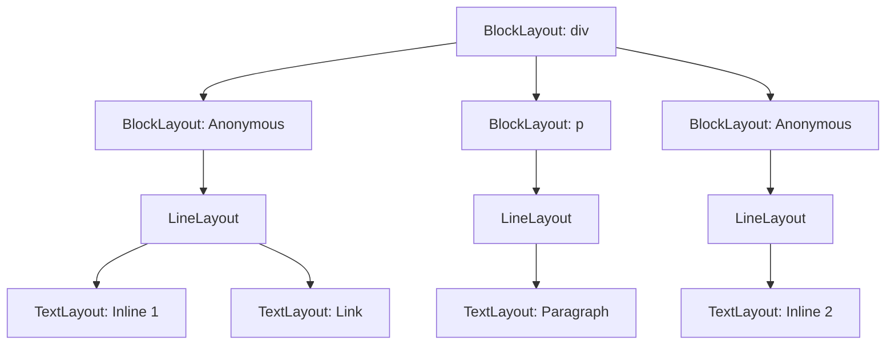

# Anonymous Block Box Generation

This diagram illustrates how `BlockLayout` handles mixed content by grouping consecutive inline elements into an "anonymous" block box.

## Rule
If a Block container (like `<div>`) contains a mix of Block elements (like `<p>`) and Inline elements (like `<span>` or text), all contiguous runs of inline elements are wrapped in an anonymous `BlockLayout` set to `Inline` mode.

## Transformation Example

### Original DOM Structure
```html
<div>
  <span>Inline 1</span>
  <a href="#">Link</a>
  <p>Paragraph</p>
  <span>Inline 2</span>
</div>
```

### Layout Tree Transformation


## Logic (Pseudo-code)
```cpp
for (child : dom_children) {
    if (is_block(child)) {
        flush_inline_run(); // Creates anonymous box if run not empty
        add_child_block(child);
    } else {
        inline_run.add(child);
    }
}
flush_inline_run();
```
