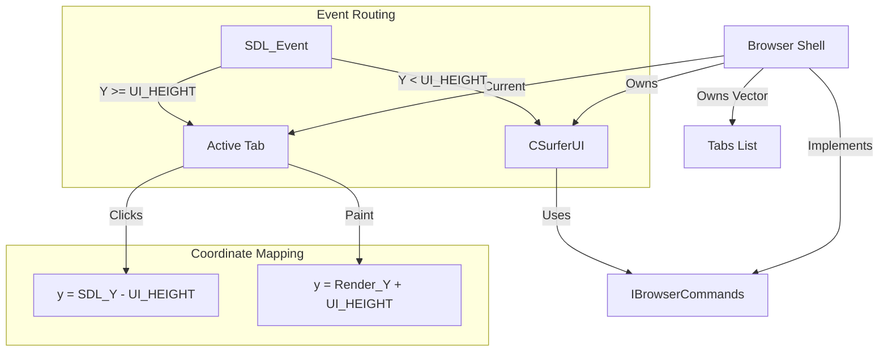

# Browser Shell Architecture (Refactor)

This diagram shows the transition from a Monolithic Browser class to a decoupled Shell architecture.

## Logic Flow

## Classes

### Browser (The Shell)
- **Lifecycle**: SDL Init/Quit
- **Orchestration**: Calls `ui.paint()` then `active_tab.paint()`
- **Input**: Routes keyboard and mouse to the correct component
- **Tab Management**: Handles adding, switching, and closing (`close_tab`) tabs.
- **IBrowserCommands**: Implements the command interface used by the UI.

### IBrowserCommands (The Bridge)
- **Interface**: Defines standard browser operations (load, new_tab, close_tab, etc.).
- **Decoupling**: Prevents the UI from depending on the concrete Browser implementation.

### CSurferUI (The Chrome)
- **Static Dimensions**: Tab Bar, URL Bar
- **Painting**: Draws the UI background, buttons (<, +, x), and blinking cursor.
- **State**: Visual focus, Address Bar text buffer.
- **Command Delegation**: Sends navigation and tab actions through `IBrowserCommands`.

### Tab (The Engine)
- **State**: History, Scroll, URL, DOM, **SkiaContext**, **SkiaFontManager**.
- **Logic**: HTML -> DOM -> Style -> Layout -> DisplayList -> **Skia Canvas** -> **SDL2 Window**.
- **about:welcome**: Hardcoded internal page for server-independent fallback.
