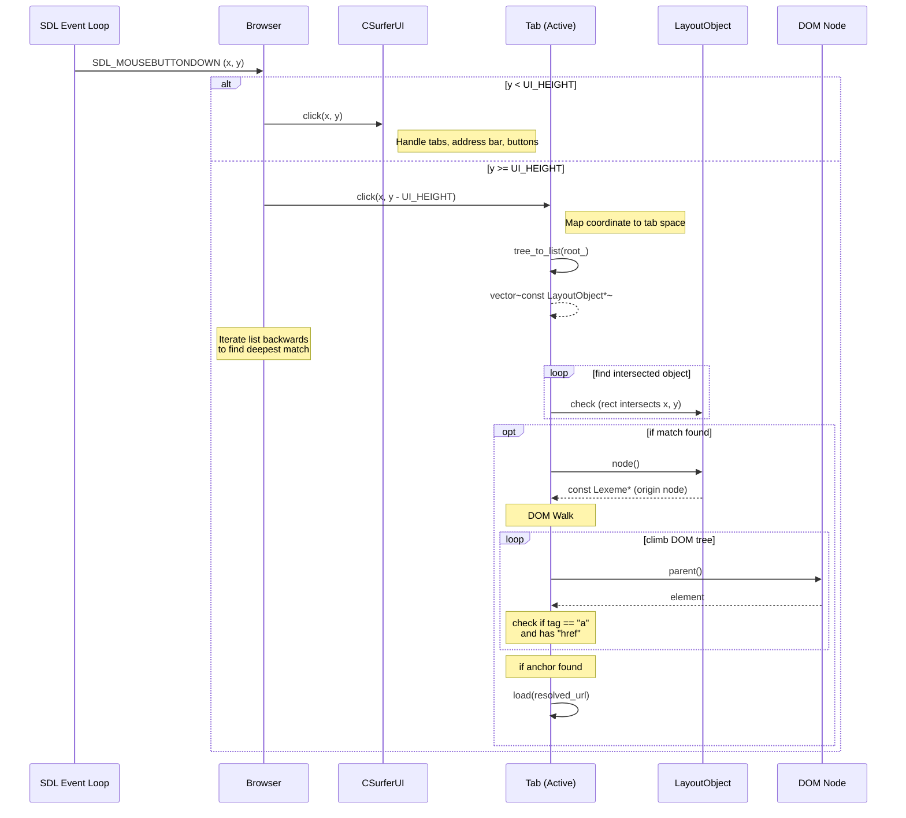

# Click & Navigation Flow

This diagram shows how a mouse click in SDL is mapped back to the DOM tree for hyperlink navigation.

```mermaid
sequenceDiagram
    participant SDL as SDL Event Loop
    participant B as Browser
    participant UI as CSurferUI
    participant T as Tab (Active)
    participant obj as LayoutObject
    participant N as DOM Node
    
    SDL->>B: SDL_MOUSEBUTTONDOWN (x, y)
    
    alt y < UI_HEIGHT
        B->>UI: click(x, y)
        note right of UI: Handle tabs, address bar, buttons
    else y >= UI_HEIGHT
        B->>T: click(x, y - UI_HEIGHT)
        note right of T: Map coordinate to tab space
        T->>T: tree_to_list(root_)
        T-->>T: vector~const LayoutObject*~
    
    note over B: Iterate list backwards<br>to find deepest match
    loop find intersected object
        T->>obj: check (rect intersects x, y)
    end
    
    opt if match found
        T->>obj: node()
        obj-->>T: const Lexeme* (origin node)
        
        note over T: DOM Walk
        loop climb DOM tree
            T->>N: parent()
            N-->>T: element
            note over T: check if tag == "a"<br>and has "href"
        end
        
        note over T: if anchor found
        T->>T: load(resolved_url)
    end
end
```
