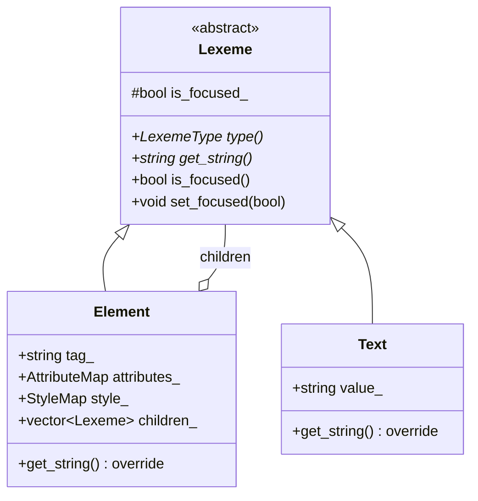

# DOM Tree Node Hierarchy

This document describes the base classes and structures used for the Document Object Model (DOM) in CSurfer.

## Class Diagram

## Focus System
As of Chapter 8, every `Lexeme` (both `Element` and `Text`) carries an `is_focused_` flag. 
- **Purpose**: To track which element should receive keyboard input and visual highlights (like a caret).
- **Logging**: The `set_focused` method in `Lexeme.cpp` logs focus changes to the console for tracking during development.
