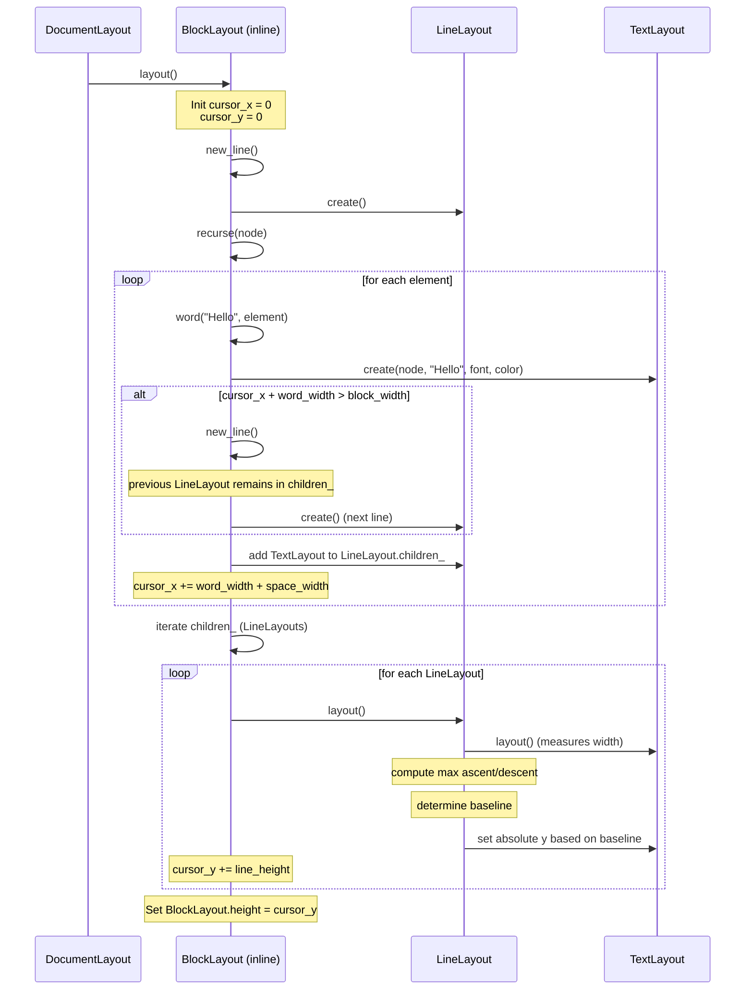

# Inline Layout Flow

This diagram shows how `BlockLayout` handles text content and splits it into lines (`LineLayout`) containing individual words (`TextLayout`).

```mermaid
sequenceDiagram
    participant D as DocumentLayout
    participant B as BlockLayout (inline)
    participant L as LineLayout
    participant T as TextLayout

    D->>B: layout()
    note over B: Init cursor_x = 0<br>cursor_y = 0
    B->>B: new_line()
    B->>L: create()
    B->>B: recurse(node)
    
    loop for each element
        B->>B: word("Hello", element)
        B->>T: create(node, "Hello", font, color)
        
        alt cursor_x + word_width > block_width
            B->>B: new_line()
            note over B: previous LineLayout remains in children_
            B->>L: create() (next line)
        end
        
        B->>L: add TextLayout to LineLayout.children_
        note over B: cursor_x += word_width + space_width
    end

    B->>B: iterate children_ (LineLayouts)
    loop for each LineLayout
        B->>L: layout()
        L->>T: layout() (measures width)
        note over L: compute max ascent/descent
        note over L: determine baseline
        L->>T: set absolute y based on baseline
        note over B: cursor_y += line_height
    end
    
    note over B: Set BlockLayout.height = cursor_y
```
