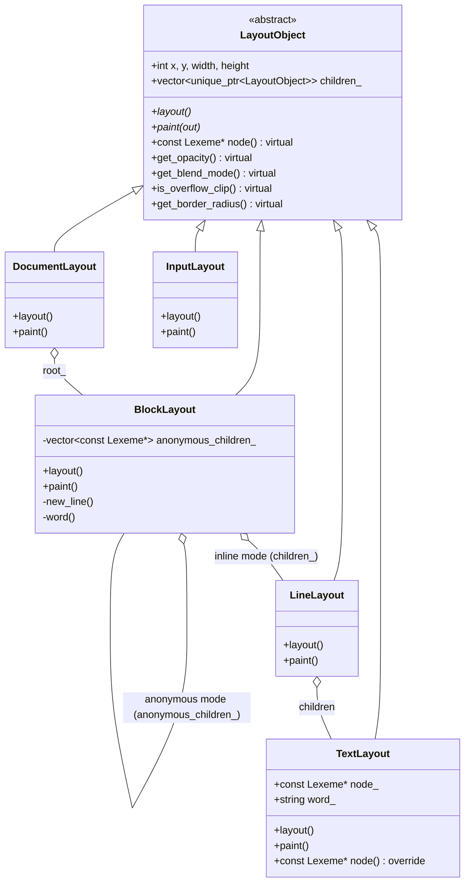

# Layout Tree Class Hierarchy

This diagram shows the class hierarchy of the layout tree objects after introducing `LineLayout` and `TextLayout`.

```mermaid
classDiagram
    class LayoutObject {
        <<abstract>>
        +int x, y, width, height
        +vector~unique_ptr~LayoutObject~~ children_
        +layout()*
        +paint(out)*
        +const Lexeme* node() virtual
        +get_opacity() virtual
        +get_blend_mode() virtual
        +is_overflow_clip() virtual
        +get_border_radius() virtual
    }

    class DocumentLayout {
        +layout()
        +paint()
    }

    class BlockLayout {
        +layout()
        +paint()
        -vector~const Lexeme*~ anonymous_children_
        -new_line()
        -word()
    }

    class LineLayout {
        +layout()
        +paint()
    }

    class TextLayout {
        +const Lexeme* node_
        +string word_
        +layout()
        +paint()
        +const Lexeme* node() override
    }

    class InputLayout {
        +layout()
        +paint()
    }

    LayoutObject <|-- DocumentLayout
    LayoutObject <|-- BlockLayout
    LayoutObject <|-- LineLayout
    LayoutObject <|-- TextLayout
    LayoutObject <|-- InputLayout

    DocumentLayout o-- BlockLayout : root_
    BlockLayout o-- BlockLayout : block mode (children_)
    BlockLayout o-- BlockLayout : anonymous mode (anonymous_children_)
    BlockLayout o-- LineLayout : inline mode (children_)
    LineLayout o-- TextLayout : children
```
