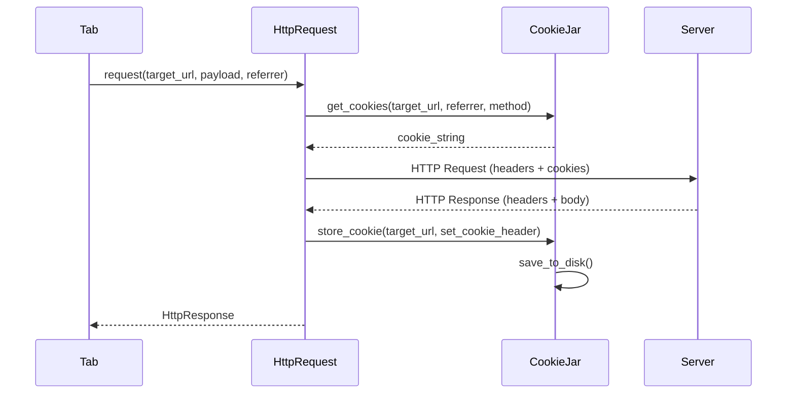

# Networking & Request Architecture

CSurfer uses a decoupled request system to handle various protocols and architectural layers (like security and persistence).

## Interface: IRequest
The `IRequest` interface is the contract for all network-bound operations. Since Chapter 10, it has been expanded to support stateful sessions and security context.

```cpp
class IRequest {
public:
  virtual HttpResponse request(const Url &url, const std::string &payload = "",
                               const Url &referrer = {}) = 0;
  virtual void set_cookie_jar(CookieJar *jar) = 0;
  virtual std::string get_cookies(const Url &url) = 0;
  virtual void set_cookie(const Url &url, const std::string &value) = 0;
};
```

## HttpRequest Implementation
The `HttpRequest` class implements the HTTP/1.0 protocol using Berkeley Sockets (and optionally OpenSSL for HTTPS).

### 1. Request Context (Referrer)
Every request now carries a `referrer` URL. This is used for two purposes:
- **Referer Header**: Automatically identifying the source of the request to the server.
- **SameSite Policy**: Providing origin context to the `CookieJar` to determine if cookies should be withheld (CSRF protection).

### 2. Cookie Interaction
Before sending the request, `HttpRequest` consults the `CookieJar` for any cookies matching the destination host and the security context of the referrer.

### 3. Response Processing
When an HTTP response is received, the headers are parsed. If a `Set-Cookie` header is found, `HttpRequest` passes it to the `CookieJar` for storage and disk-based persistence.

## Request Execution Flow (Mermaid)


