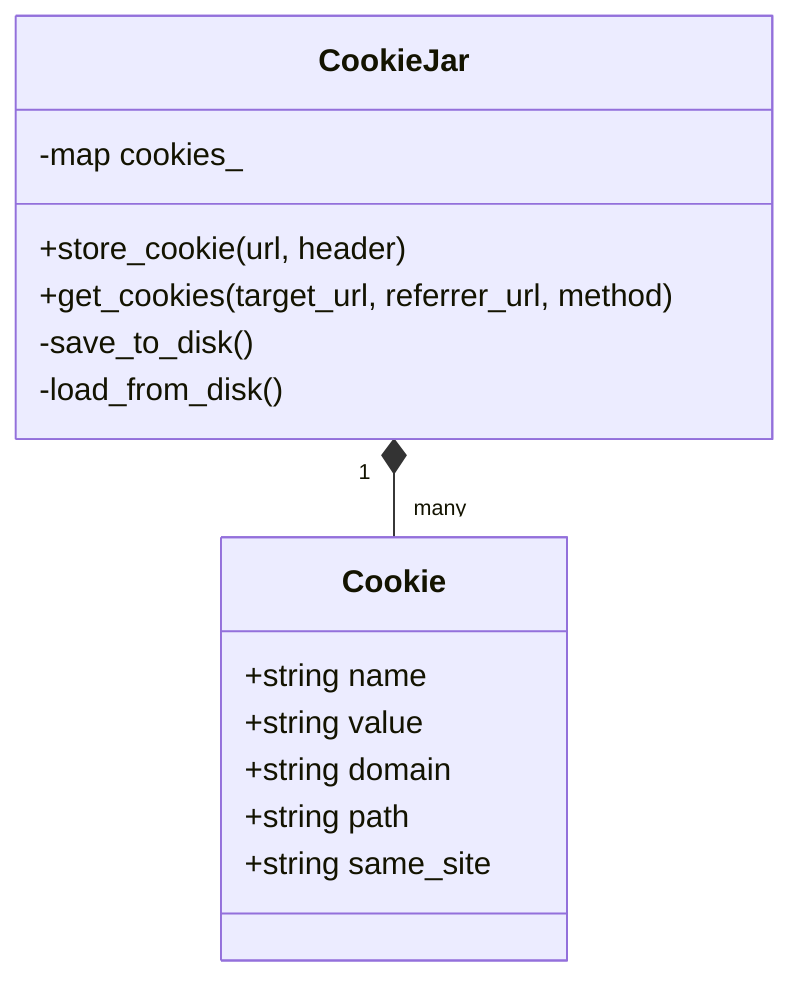
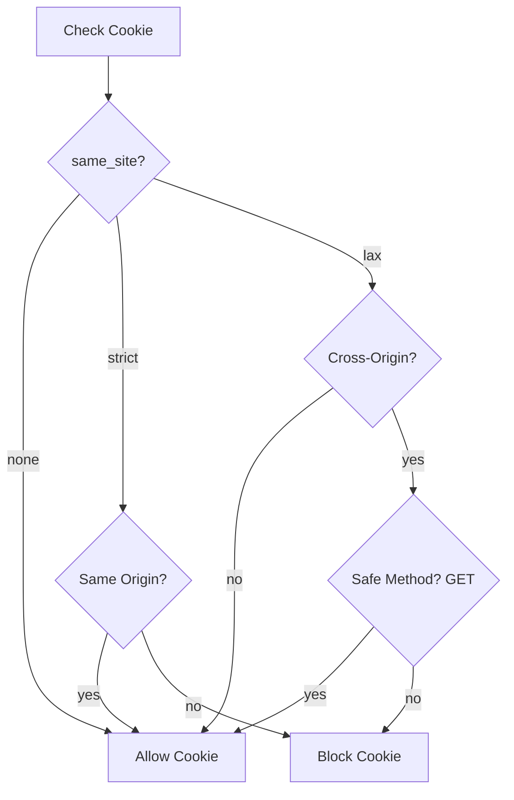

# Security Subsystem Internals

This document describes the internal logic of the CSurfer security model, specifically focusing on session management and CSRF protection.

## Data Model: CookieJar

The `CookieJar` is a centralized repository for HTTP cookies, managed by the `Tab` and accessed by the `HttpRequest` engine.

### Class Structure

## SameSite=Lax Enforcement Logic

The core of our CSRF defense is the state machine within `get_cookies`. It determines whether a cookie is "safe" to send based on the navigational context.

### Decision Tree

## Persistence Layer

Cookies are stored in a hidden file named `.csurfer_cookies` in the repository root.

### Serialization Format
The jar uses a pipe-delimited text format for simplicity:
`domain|name|value|same_site|path`

### Lifecycle
- **Load**: Triggered automatically when the `CookieJar` is instantiated (once per Browser/Tab initialization).
- **Save**: Triggered proactively every time `store_cookie` is called (whenever a server sends a `Set-Cookie` header).

## Integration with JS Runtime
The `CookieJar` is exposed to the JavaScript environment through two native bindings in `JSContext`:
- `native_cookie_get`: Formats all allowed cookies into a string for `document.cookie`.
- `native_cookie_set`: Parses a JS-provided cookie string and stores it in the jar.
