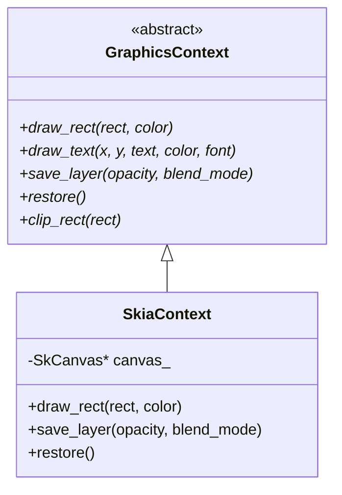

# Skia Rendering Pipeline & Visual Effects

CSurfer uses [Skia](https://skia.org/) as its core rendering engine. This document describes the abstraction layer and the pipeline for advanced visual effects.

## Graphics Abstraction Layer

To keep the layout engine decoupled from the specific rendering backend, we use the `gfx::GraphicsContext` interface.

## Font Abstraction

Text rendering is handled via a font manager that caches typefaces.

*   **`gfx::Font`**: Abstract handle for a specific font face and size.
*   **`gfx::FontManager`**: Responsible for loading fonts from `assets/fonts/` and providing `gfx::Font` instances.
*   **`gfx::SkiaFont`**: Skia-specific implementation using `SkTypeface` and `SkFont`.

## Display List Commands

Painting the layout tree produces a flat list of `DrawCommand` objects. These are recorded once and executed during the rasterization phase.

| Command | Purpose |
|---------|---------|
| `DrawText` | Renders a string of text. |
| `DrawRect` | Fills a solid rectangle. |
| `DrawRoundedRect` | Fills a rectangle with rounded corners. |
| `DrawLine` | Draws a single line (borders, carets). |
| `DrawBoxShadow` | Renders a blurred drop shadow using `SkImageFilters::DropShadow`. |
| `DrawLinearGradient` | Fills an area with a gradient using `SkGradientShader`. |
| `DrawSaveLayer` | Pushes a new offscreen buffer with optional opacity and blend mode. |
| `DrawRestore` | Pops the current layer and composites it back. |

## Visual Effects Pipeline

Advanced effects are implemented by wrapping sub-trees of the layout tree in "Layers".

### Opacity & Blending
When `paint_tree` encounters a node with `opacity < 1.0` or a `mix-blend-mode`, it:
1.  Inserts a `DrawSaveLayer(opacity, blend_mode)` into the display list.
2.  Recursively paints all children.
3.  Inserts a `DrawRestore()`.

### Clipping (`overflow: clip`)
Clipping to a `border-radius` uses a specialized masking technique:
1.  Push a new layer with `destination-in` blend mode.
2.  Render the element's content.
3.  Draw a **White** `DrawRoundedRect` into that same layer.
4.  Because of `destination-in`, only the parts of the content that overlap with the white rect are preserved.
